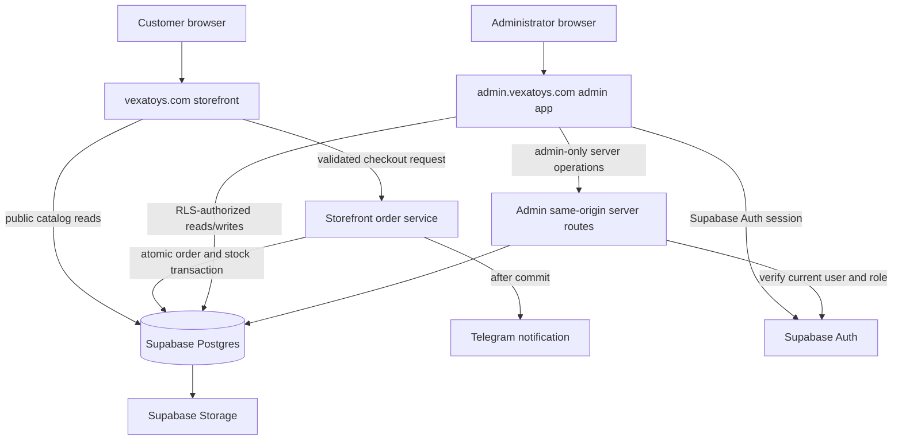

# Admin boundary and storefront migration map

## Purpose

The administrator application will live in the separate `admin-vexatoys`
repository and be deployed at `https://admin.vexatoys.com`. Supabase will
replace Firebase as the shared database and authentication platform.

This document maps the legacy admin behavior that must leave the storefront
repository and defines the boundary between the two applications.

## Current storefront behavior to retire

The current `vexatoys.com/admin` page renders `AdminPanel` inside the public
storefront bundle. Its SHA-256 password verifier, session flag, and lockout are
browser controlled. The unlocked panel reads and writes Firebase directly and
calls public deployment, upload, image-migration, revalidation, IndexNow, and
Telegram endpoints.

| Current area | Capability | Current dependency | Destination |
| --- | --- | --- | --- |
| Admin login | Client-side password comparison | Browser storage | Supabase Auth in `admin-vexatoys` |
| Orders | List PII, filter, change status, delete | Firebase `orders` | Admin app plus Supabase RLS |
| Products | Add, edit, delete, manage stock/categories/variants/images | Firebase collections and upload route | Admin app plus normalized Supabase tables and Storage |
| Articles | Add, edit, delete | Firebase `blogPosts` | Admin app plus Supabase articles table |
| Image migration | Scan, migrate, activate images | Firebase, Vercel Blob, public route | One-time controlled migration outside routine navigation |
| Deployment | Invoke Vercel deploy hook | Public storefront route | Remove, or restrict to admin operations if still required |

After cutover, the storefront must not ship the legacy admin component, admin
password hash, privileged actions, or `/admin` page. The old path should return
`404/410` or redirect to the admin subdomain only if the client wants the admin
hostname to be discoverable. Returning `404/410` is the safer default.

## Target two-repository boundary

### `My-website` owns

- Public catalog, categories, product details, articles, cart, and checkout.
- Public read access only to published catalog/content data permitted by RLS.
- A same-origin order endpoint that validates input, reloads authoritative
  prices, and commits the order and stock change atomically.
- Telegram notification creation after a committed order. The browser never
  supplies arbitrary Telegram text.
- SEO routes, sitemap, robots, canonicals, redirects, and public cache behavior.

### `admin-vexatoys` owns

- Supabase Auth sign-in, sign-out, session refresh, and protected navigation.
- Dashboard, orders, products, content, inventory, and restricted operations.
- Admin-only API routes that verify the current Supabase user and admin role.
- Audit presentation and operational failure visibility.
- The deployment configuration for `admin.vexatoys.com`.

### Supabase owns

- The durable product, content, order, stock, notification, and audit records.
- Authentication and server-verifiable sessions.
- Row Level Security for every table exposed through the Data API.
- Product media in a controlled Storage bucket.
- Database transactions and constraints that enforce order/stock consistency.

## Cross-application security model

- Browser clients receive only the Supabase project URL and publishable key.
- The Supabase secret/service-role key is server-only and must never use a
  `NEXT_PUBLIC_` name or be sent to either browser.
- Admin authorization uses a role stored in Supabase `app_metadata`, never
  user-editable `user_metadata`.
- Server protection validates claims with `getClaims()` or requests a fresh user
  with `getUser()` when current account state is required. Server code must not
  authorize from an unverified `getSession()` result.
- Routine admin database requests should use the administrator's session so RLS
  remains active. Server secret access is limited to operations that truly need
  elevated privileges.
- RLS and explicit table grants are both required. `TO authenticated` alone is
  insufficient because it authenticates a caller without proving admin rights.
- Auth cookies are host-only for `admin.vexatoys.com`. The storefront does not
  need or receive the admin session.
- Admin APIs remain same-origin under the admin subdomain. No permissive CORS
  bridge between the storefront and admin app is required.

## Target storefront order flow

1. Checkout generates an idempotency key and submits customer details plus
   product IDs, quantities, and selected variants to `POST /api/orders`.
2. The storefront server validates field formats and limits, reloads published
   products and current prices from Supabase, and rejects unavailable stock.
3. One database transaction creates `orders` and `order_items`, decrements
   inventory with a non-negative constraint, and records the idempotency key.
4. The server returns the committed order ID. Only then does the UI clear the
   cart and show success.
5. Telegram text is built server-side from the committed record. Notification
   status is stored so retries are bounded and visible to the admin app.

## Supabase access summary

| Data | Storefront visitor | Authenticated admin | Server-only worker |
| --- | --- | --- | --- |
| Published products/categories/articles | Read | Read/write | Read/write when required |
| Draft/archived content | No access | Read/write | Read/write when required |
| Orders and customer PII | No direct access | Read/update under admin RLS | Create through validated order service |
| Inventory | Read available quantity if needed | Read/update | Atomic decrement during checkout |
| Notifications | No access | Read/retry through protected action | Create/update delivery state |
| Audit records | No access | Read | Append |

## Storefront acceptance criteria

- `/admin` no longer serves a privileged client application or embeds an admin
  password verifier.
- Public clients cannot list orders, customer PII, drafts, audit records, or
  notification records through Supabase.
- Public clients cannot mutate products, content, stock, or order statuses.
- Checkout never reports success until the Supabase transaction commits.
- Replaying the same idempotency key creates one order.
- Concurrent orders cannot reduce stock below zero.
- Telegram is invoked only from server-owned committed order data.
- Firebase access and duplicate privileged endpoints are removed after data
  migration and cutover verification.

The detailed admin page and database maps live in the `admin-vexatoys`
repository documentation.
